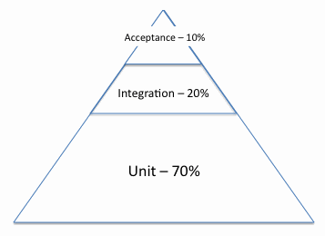

<h2>Table of Contents</h2>

<ul>
<li><a href="#sec-1">1. Definitions</a></li>
<li><a href="#sec-2">2. Test Suite Layers</a>
<ul>
<li><a href="#sec-2-1">2.1. Ratio</a>
<ul>
<li><a href="#sec-2-1-1">2.1.1. testing pyramid</a></li>
</ul>
</li>
</ul>
</li>
<li><a href="#sec-3">3. Desirable Qualities</a>
<ul>
<li><a href="#sec-3-1">3.1. Focused</a></li>
<li><a href="#sec-3-2">3.2. Fast</a></li>
<li><a href="#sec-3-3">3.3. Readable</a></li>
<li><a href="#sec-3-4">3.4. Concrete</a></li>
</ul>
</li>
<li><a href="#sec-4">4. Reference</a>
<ul>
<li><a href="#sec-4-1">4.1. Danger of too much end-to-end testing</a></li>
<li><a href="#sec-4-2">4.2. Testing Pyramid</a></li>
<li><a href="#sec-4-3">4.3. Patterns</a></li>
<li><a href="#sec-4-4">4.4. Anti-patterns</a></li>
</ul>
</li>
</ul>

# Definitions

-   SUT
    Subject Under Test. The thing being tested. In OO unit tests, it
    will usually be an object.
-   TDD
    Test Driven Development. A test-first practice to get the most
    useful design information out of your tests
-   BDD
    Behavior Driven Development. A style of TDD specifically working
    from the outside of your application inwards.
-   Regression
    A regression test is a test that documents a bug, and verifies that
    it does not return. They are basically created as follows: I
    discover a bug. I write a test (at the lowest level possible) which
    fails because of the bug. I then fix the bug, and verify that the
    test passes. I can now keep this test around to A: document my
    assumptions about the bug (because if it crops up again, but the
    test is still passing, then we know the bug was incorrectly
    diagnosed) and B: prevent regressions. In long-running codebases
    some pernicious bugs will have a tendancy to re-appear (often due to
    a misunderstanding of the domain by the development team), and good
    regression tests help prevent their re-appearance.

# Test Suite Layers

-   Unit
    Unit tests isolate the smallest piece of behavior possible. In OO
    this will usually be an object. "Unit" is subjective, and will be
    defined differently in different domains.
-   Feature/End-To-End/Acceptance/UI
    This is the highest level of testing. The SUT is a chunk of
    behavior, a feature, rather than a chunk of code. "End-To-End" means
    that you are only testing what is at the outer layers of the
    application (usually the UI). "Acceptance test" is a feature test
    written to be a true verification of the acceptance critieria of a
    user story.
-   Integration/Service
    Integration tests are everything that isn't End-To-End, but that
    involves multiple pieces working together. What that means depends
    on how "unit" is defined. You'll often also see these called
    "service" tests.

## Ratio

The most cost-effective test suites will tend to adhere to the
testing pyramid.

### testing pyramid

The classic testing pyramid says that the bulk of the tests should
be unit tests. A far smaller number of tests should be integration
tests. And and even smaller number than that should be Feature tests.

The main goal of the testing pyramid is cost
effectiveness. It is a necessary reminder because its opposite,
the inverted test pyramid, will often be the outcome of
undisciplined teams.

The inverted pyramid is a common mistake because end-to-end tests
often appear to provide the highest value. They adhere to the user
experience, they are the easiest for non-programmer staff to write
and understand, and cover the most functionality.

But the inverted pyramid will result in a test suite that provides
a very low value for the cost of its upkeep.

# Desirable Qualities

A good test suite is:

## Focused

The logic to be tested is contained in as small and isolated a SUT
as possible.

## Fast

The slower a test suite is, the less often it will be run. The
less often a test suite is run, the longer the gap will be between
creating a bug, and discovering the bug. The longer this gap is,
the harder the bug will be to diagnose and fix. Fast test suites
enable smart testing practices like TDD.

A fast test suite will encourage writing fast tests, which
encourages a proper testing pyramid because well-written unit
tests are often the fastest.

## Readable

A well-written test suite is like self-verifying documentation. The
tests will not just verify behavior, but will demonstrate how the
SUT is to be used.

## Concrete

Abstractions in tests are less desirable than abstractions in
application code. It is better for a test to be verbose, than to
hide what is going on. )

Assert literal values whenever possible (See ). Assertions should not compare values computed by the
application, to values computed by the tests. Ideally assertions
should be comparing computed values to hard-coded values. Often if
it seems like the expected value must be computed, a
can be used instead.

# Reference

## Danger of too much end-to-end testing

<https://testing.googleblog.com/2015/04/just-say-no-to-more-end-to-end-tests.html>
[Integration Tests Are A Scam (Influential Talk)](https://www.youtube.com/watch?v%3DVDfX44fZoMc)

## Testing Pyramid

<https://martinfowler.com/bliki/TestPyramid.html>

## Patterns

[Golden Master](http://blog.codeclimate.com/blog/2014/02/20/gold-master-testing/)

## Anti-patterns

[Mystery Guest / Obscure Test](http://xunitpatterns.com/Obscure%2520Test.html)
[Ugly Mirror](http://jasonrudolph.com/blog/2008/07/30/testing-anti-patterns-the-ugly-mirror/)
